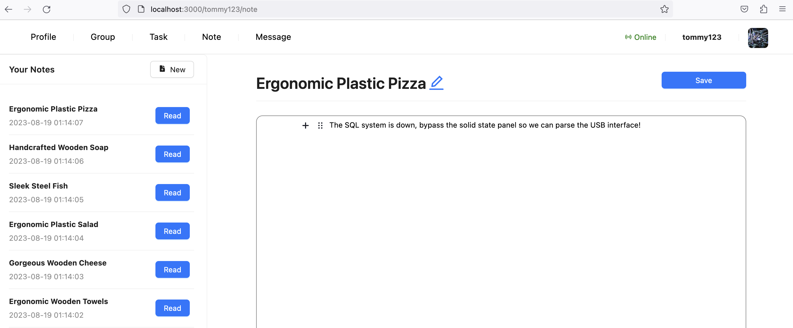

# campfire
This is an application for people who want to study together.  Grouping, Joining, Planning, Taking Note, Task Arrangement.

## Before Starting

- RabbitMQ enable `rabbitmq_stomp` plugin

### Backend

- Update your MySQL, Redis, RabbitMQ Address.
- Spring Cloud Alibaba Seata is required to be started before starting services.

- `config-center`, modify the `spring.cloud.config.server.native.search-locations` to the location that stores the configuration files.

- `file` service, modify the file storage address in `file-storage`.

### Frontend

- Modify request address in `next.config.js`
- Modify `brokerURL` in `layout.js` at method `initWebSocket`

## Introduction

This application is a distributed, micro-service application based on Spring Cloud.

### Beginning

### Group Activities

### Group or Personal Task Arrangment

Integrated with [react-big-calendar](https://github.com/jquense/react-big-calendar)

### Notes

Integrated with [Editor.js](https://github.com/codex-team/editor.js)

### System Notifications

### Instant Message Service (Distributed)

### Email Service

System can send email including content like account verification or password reset.
